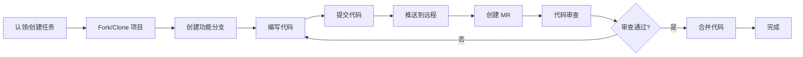

# 贡献指南

欢迎为金恒科技信息化部前端团队的项目贡献代码！本指南将帮助你了解如何参与项目开发。

<AuthorTag author="CHENY" />

## 📋 贡献流程概览



## 🚀 开始贡献

### 1. 环境准备

确保你已经完成了[快速开始](/views/guide/getting-started)中的环境配置。

```bash
# 检查工具版本
node -v   # >= 22.13.0
pnpm -v   # >= 10.16.1
git -v    # >= 2.30.0
```

### 2. 获取代码

```bash
# 克隆项目（公司 GitLab）
git clone https://gitlab.jggroup.cn/frontend/your-project.git

# 进入项目目录
cd your-project

# 安装依赖
pnpm install
```

::: tip 💡 提示
项目托管在公司 GitLab（`https://gitlab.jggroup.cn`），请确保你已完成账号注册和 SSH Key 配置。
:::

## 🌿 分支策略

我们采用 **Git Flow** 分支模型，请严格遵循以下分支规范。

### 主要分支

| 分支      | 说明                             | 生命周期 |
| --------- | -------------------------------- | -------- |
| `main`    | 生产环境代码，始终保持可发布状态 | 永久     |
| `develop` | 开发主分支，包含最新的开发进度   | 永久     |

### 辅助分支

| 分支类型    | 命名规范                           | 说明             | 示例                         |
| ----------- | ---------------------------------- | ---------------- | ---------------------------- |
| **feature** | `feature/<issue-id>-<description>` | 新功能开发       | `feature/123-user-login`     |
| **bugfix**  | `bugfix/<issue-id>-<description>`  | Bug 修复         | `bugfix/456-fix-login-error` |
| **hotfix**  | `hotfix/<version>-<description>`   | 紧急修复（生产） | `hotfix/1.2.1-critical-fix`  |
| **release** | `release/<version>`                | 发布准备         | `release/1.3.0`              |

### 分支创建规则

```bash
# 开发新功能（从 develop 创建）
git checkout develop
git pull origin develop
git checkout -b feature/123-user-profile

# 修复 Bug（从 develop 创建）
git checkout develop
git pull origin develop
git checkout -b bugfix/456-fix-typo

# 紧急修复（从 main 创建）
git checkout main
git pull origin main
git checkout -b hotfix/1.2.1-security-patch
```

## 💻 开发流程

### 1. 获取任务

任务分配方式：

- **微信指派**：Tech Leader 或项目负责人通过微信直接指派
- **主动认领**：查看嘉为蓝鲸平台的任务列表，主动沟通认领
- **自发开发**：发现问题或有优化想法，可主动提出并实施

::: tip 💡 任务管理
团队使用 **嘉为蓝鲸** 平台进行任务管理和跟踪。任务详情、进度更新都在该平台完成。
:::

### 2. 创建分支

```bash
# 确保 develop 是最新的
git checkout develop
git pull origin develop

# 创建功能分支（根据任务编号命名）
git checkout -b feature/TASK-123-add-user-module
```

::: warning ⚠️ 注意
分支命名中的任务编号（如 `TASK-123`）对应嘉为蓝鲸平台中的任务 ID，便于追溯。

#### 代码规范

- 遵循[开发规范](/views/guide/development-standards)
- 遵循[提交规范](/views/guide/commit-standards)
- 使用团队统一的代码检查工具：
  - **ESLint**：JavaScript/TypeScript 代码检查
  - **Prettier**：代码格式化
  - **Stylelint**：CSS/SCSS 样式检查
- 编写单元测试（重要功能模块）

#### 代码质量检查

```bash
# 运行所有检查工具
pnpm lint

# 单独运行 ESLint
pnpm lint:eslint

# 单独运行 Prettier
pnpm lint:prettier

# 单独运行 Stylelint
pnpm lint:style

# 自动修复可修复的问题
pnpm lint:fix

# 运行测试
pnpm test

# 检查类型
pnpm type-check
```

::: tip 💡 提示
建议在 VS Code 中安装 ESLint、Prettier、Stylelint 扩展，实现保存时自动格式化和错误提示。
:::m test

# 检查类型

pnpm type-check

````

### 4. 提交代码

我们使用 **Commitizen** 进行规范化提交：

```bash
# 添加文件到暂存区
git add .

# 使用 git-cz 提交（推荐）
pnpm commit
# 或
git cz

# 按照提示选择：
# 1. 选择提交类型（feat/fix/docs...）
# 2. 输入影响范围（可选）
# 3. 写简短描述
# 4. 写详细描述（可选）
# 5. 是否有破坏性变更（可选）
# 6. 关联 Issue（可选）
````

#### 提交信息示例

````bash
# 好的提交信息 ✅
### 5. 推送代码

```bash
# 推送到远程仓库
git push origin feature/TASK-123-add-user-module

# 如果是首次推送
git push -u origin feature/TASK-123-add-user-module
```好的提交信息 ❌
update code
fix bug
修改了一些东西
````

详细的提交规范请查看[提交规范文档](/views/guide/commit-standards)。

### 5. 推送代码

```bash
# 推送到远程仓库
git push origin feature/123-add-user-module

# 如果是首次推送
git push -u origin feature/123-add-user-module
```

## 🔄 创建 Merge Request

### 1. 在 GitLab 上创建 MR

1. 访问项目的 GitLab 页面
2. 点击 "Merge Requests" -> "New merge request"
3. 选择源分支和目标分支
4. 填写 MR 信息

### 2. MR 标题规范

```
<type>: <description> (TASK-xxx)
```

**示例：**

```
feat: 添加用户个人资料编辑功能 (TASK-123)
fix: 修复登录页面输入框校验问题 (TASK-456)
docs: 更新 API 文档 (TASK-789)
```

### 3. MR 描述模板

````markdown
## 📝 变更说明

<!-- 简要描述本次变更的内容和目的 -->

## 🔗 关联任务

蓝鲸任务：TASK-123

## ✅ 变更类型

- [ ] 新功能（feature）
- [ ] Bug 修复（bugfix）
- [ ] 代码重构（refactor）
- [ ] 文档更新（docs）
- [ ] 性能优化（perf）
- [ ] 测试相关（test）
- [ ] 构建相关（build）
- [ ] 其他（chore）

## 🧪 测试情况

- [ ] 已添加单元测试
- [ ] 已添加集成测试
- [ ] 已进行手动测试
- [ ] 功能正常运行

## 📸 截图（如适用）

<!-- 添加相关截图或动图 -->

## 📋 检查清单

- [ ] 代码符合团队规范
- [ ] 已运行 `pnpm lint` 且无错误
- [ ] 已运行 ESLint、Prettier、Stylelint 检查
- [ ] 已运行 `pnpm test` 且全部通过
- [ ] 已更新相关文档
- [ ] 提交信息符合规范
- [ ] 已自测功能正常

## 💡 备注

<!-- 其他需要说明的信息 -->

```] 已自测功能正常

## 💡 备注
<!-- 其他需要说明的信息 -->
```
````

### 4. 指定 Reviewer

**审批要求：**

- 至少 **1 人审批通过**即可合并
- 建议指定：Tech Leader、项目负责人或相关模块负责人

**审批流程：**

1. 创建 MR 后自动通知 Reviewer
2. Reviewer 进行代码审查
3. 提出修改意见或直接通过
4. 1 人通过后即可合并

### 5. 标签管理

| 标签            | 说明     | 使用场景         |
| --------------- | -------- | ---------------- |
| `enhancement`   | 功能增强 | 新功能开发       |
| `bug`           | Bug 修复 | 问题修复         |
| `documentation` | 文档更新 | 文档相关         |
| `urgent`        | 紧急     | 需要优先处理     |
| `WIP`           | 进行中   | 未完成的 MR      |
| `needs-review`  | 待审查   | 等待 Code Review |

## 👀 代码审查

### 审查者职责

1. **及时审查**：24 小时内完成审查
2. **细致检查**：
   - 代码质量和规范性
   - 逻辑正确性和健壮性
   - 性能和安全问题
   - 测试覆盖率
3. **建设性反馈**：提供具体的改进建议

### 审查标准

#### ✅ 通过标准

- 代码符合团队规范
- 功能实现正确
- 测试覆盖充分
- 无明显性能问题
- 文档完善

#### ❌ 需要修改

- 代码规范问题
- 逻辑错误
- 测试不足
- 性能问题
- 安全隐患

### 提交者职责

1. **及时响应**：24 小时内响应审查意见
2. **积极沟通**：不明确的地方主动沟通
3. **认真修改**：根据反馈修改代码
4. **标记完成**：修改后在评论中标记"已修改"

## 🎯 合并要求

### 合并前检查清单

- [ ] **至少 1 人审批通过**
- [ ] 所有审查意见已解决
- [ ] CI/CD 流程全部通过（如已配置）
- [ ] 无代码冲突
- [ ] 代码检查工具（ESLint/Prettier/Stylelint）全部通过
- [ ] 测试用例通过
- [ ] 文档已更新

### 合并策略

```bash
# feature 分支合并到 develop
feature/* -> develop (Squash and Merge)

# develop 合并到 main（发布）
develop -> main (Merge Commit)

# hotfix 合并到 main 和 develop
hotfix/* -> main (Merge Commit)
hotfix/* -> develop (Merge Commit)
```

### 合并后清理

```bash
# 删除本地分支
git branch -d feature/TASK-123-add-user-module

# 删除远程分支（GitLab 可配置自动删除）
git push origin --delete feature/TASK-123-add-user-module
```

::: tip 💡 提示
建议在 GitLab 项目设置中开启"合并后自动删除源分支"选项，减少手动操作。
:::

## 🐛 Bug 反馈

### 反馈渠道

**方式一：嘉为蓝鲸平台**
在蓝鲸平台创建缺陷任务，填写详细的 Bug 信息。

**方式二：微信沟通**
紧急 Bug 可直接通过微信联系 Tech Leader（工号 409322）或项目负责人。

### Bug 报告模板

在蓝鲸平台或微信中提供以下信息：

```markdown
## 🐛 Bug 描述

<!-- 清晰简洁地描述 Bug -->

## 📋 复现步骤

1. 访问 '...'
2. 点击 '...'
3. 滚动到 '...'
4. 看到错误

## ✅ 期望行为

<!-- 描述你期望发生什么 -->

## ❌ 实际行为

<!-- 描述实际发生了什么 -->

## 📸 截图

<!-- 如果适用，添加截图帮助解释问题 -->

## 💻 环境信息

- OS: [如 Windows 11]
- Browser: [如 Chrome 120]
- Node: [如 v22.13.0]
- 项目版本: [如 1.2.0]

## 🔴 优先级

- [ ] 紧急（影响生产环境）
- [ ] 高（影响主要功能）
- [ ] 中（影响次要功能）
- [ ] 低（优化建议）

## 📝 补充信息

<!-- 其他相关信息 -->
```

## 📚 最佳实践

### 1. 提交粒度

- ✅ **小而美**：每次提交只做一件事
- ✅ **原子性**：提交是完整的、可回滚的

### 3. 代码冲突处理

```bash
# 1. 拉取最新代码
git fetch origin
git merge origin/develop

# 2. 解决冲突
# 手动编辑冲突文件，保留正确的代码

# 3. 运行代码检查确保没问题
pnpm lint
pnpm test

# 4. 标记已解决
git add .

# 5. 完成合并
git commit -m "chore: resolve merge conflicts"
```

```bash
# 1. 拉取最新代码
git fetch origin
git merge origin/develop

# 2. 解决冲突
# 手动编辑冲突文件

# 3. 标记已解决
git add .

# 4. 完成合并
git commit -m "chore: resolve merge conflicts"
```

### 4. 回滚操作

```bash
# 撤销最后一次提交（保留更改）
git reset --soft HEAD~1

# 撤销最后一次提交（丢弃更改）
git reset --hard HEAD~1

# 撤销某个文件的修改
git checkout -- file.ts
```

## 🔐 安全规范

### 敏感信息

- ❌ **禁止**提交密码、Token、密钥
- ❌ **禁止**提交内网 IP、域名
- ✅ **使用**环境变量管理配置
- ✅ **使用** `.env.example` 作为模板

### Code Review 重点

- 检查是否有敏感信息泄露

## 📞 获取帮助

如果遇到问题，可以通过以下方式获取帮助：

1. **查阅文档**：

   - [快速开始](/views/guide/getting-started)
   - [开发规范](/views/guide/development-standards)
   - [提交规范](/views/guide/commit-standards)

2. **团队沟通**：

   - **微信群**：`金恒前端团队`
   - **Tech Leader**：工号 409322
   - **项目负责人**：根据具体项目确定

3. **任务平台**：

   - **嘉为蓝鲸**：提交问题工单或查看任务详情
   - 平台内可直接@相关负责人

4. **提 Issue**：
   - 在 GitLab Issues 中提问
   - 使用 `question` 标签

## 🎖️ 贡献者

感谢所有为项目做出贡献的开发者！

<!-- 可以添加贡献者列表或贡献图表 -->

## 📄 许可

本项目为金恒科技内部项目，版权归金恒科技所有，未经许可不得对外分发。

---

## 🔗 相关文档

- [快速开始](/views/guide/getting-started)
- [开发规范](/views/guide/development-standards)
- [提交规范](/views/guide/commit-standards)
- [项目结构](/views/guide/project-structure)

::: tip 💡 提示
遵循规范不仅能提高代码质量，还能让团队协作更加顺畅。如有疑问，请随时联系 Tech Leader（工号 409322）。
:::
